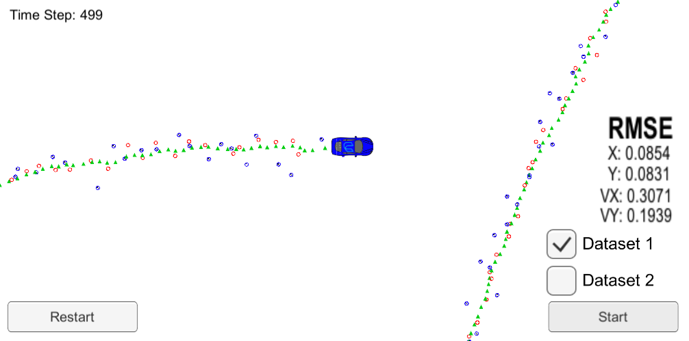
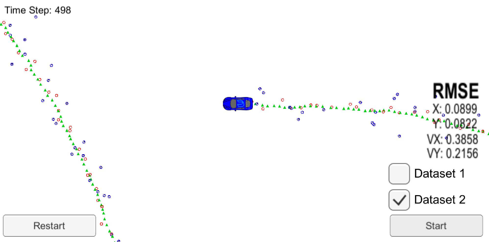

# Unscented Kalman Filter Project Starter Code
Self-Driving Car Engineer Nanodegree Program

## Topics in rubric

### 1. Your code should compile.

My result code compiles as instructed.

### 2. px, py, vx, vy output coordinates must have an RMSE <= [.09, .10, .40, .30] when using the file: "obj_pose-laser-radar-synthetic-input.txt which is the same data file the simulator uses for Dataset 1"

My result has the RMSE within the criteria.

### 3. Your Sensor Fusion algorithm follows the general processing flow as taught in the preceding lessons.

My result works in accordance with the instruction. Below is the instruction from the course.

1) main.cpp - reads in data, calls a function to run the Unscented Kalman filter, calls a function to calculate RMSE
2) ukf.cpp - initializes the Unscented Kalman filter, calls the predict and update function, defines the predict and update functions
3) tools.cpp- function to calculate RMSE

### 3. Your Kalman Filter algorithm handles the first measurements appropriately.

My result code receives the first measurements from main.cpp and initialize variables. The code is in ukf.cpp line 85 ~ 125.

### 4. Your Kalman Filter algorithm first predicts then updates.

My code does prediction first by calling Prediction(dt) (in 141, ukf.cpp) and then does update by calling UpdateLider or UpdateRadar (in 144 ~ 148, ukf.cpp)

### 5. Your Kalman Filter can handle radar and lidar measurements.

When initialization, it takes laser and radar data separately by checking meas_package.sensor_type_ and use_laser or use_radar.
Also when update, it has two individual functions for each sensor measurement, which are UpdateLidar and UpdateRadar.

### 6. Your algorithm should avoid unnecessary calculations.

I reviewed my code and checked if any part in my code does repeated or unnecessary calculations.

### 7. Side notes

ExtendedKF vs. UnscentedKF: From my results, unscented kalman filter performs better than extended kalman filter.
However, it took much more time to tweak some variables like std_a, std_yawdd_, x_ and P_ for initialization.

| dataset1  | ExtendedKF | UnscentedKF |
|---|---|---|
| x  | 0.0954 | 0.0854 |
| y  | 0.0837 | 0.0831 |
| vx | 0.4499 | 0.3079 |
| vy | 0.4357 | 0.1939 |

| dataset2 | ExtendedKF | UnscentedKF |
|---|---|---|
| x  | 0.0744 | 0.0899 |
| y  | 0.0958 | 0.0822 |
| vx | 0.4583 | 0.3858 |
| vy | 0.4943 | 0.2156 |

---

In this project utilize an Unscented Kalman Filter to estimate the state of a moving object of interest with noisy lidar and radar measurements. Passing the project requires obtaining RMSE values that are lower that the tolerance outlined in the project reburic. 

This project involves the Term 2 Simulator which can be downloaded [here](https://github.com/udacity/self-driving-car-sim/releases)

This repository includes two files that can be used to set up and intall [uWebSocketIO](https://github.com/uWebSockets/uWebSockets) for either Linux or Mac systems. For windows you can use either Docker, VMware, or even [Windows 10 Bash on Ubuntu](https://www.howtogeek.com/249966/how-to-install-and-use-the-linux-bash-shell-on-windows-10/) to install uWebSocketIO. Please see [this concept in the classroom](https://classroom.udacity.com/nanodegrees/nd013/parts/40f38239-66b6-46ec-ae68-03afd8a601c8/modules/0949fca6-b379-42af-a919-ee50aa304e6a/lessons/f758c44c-5e40-4e01-93b5-1a82aa4e044f/concepts/16cf4a78-4fc7-49e1-8621-3450ca938b77) for the required version and installation scripts.

Once the install for uWebSocketIO is complete, the main program can be built and ran by doing the following from the project top directory.

1. mkdir build
2. cd build
3. cmake ..
4. make
5. ./UnscentedKF

Tips for setting up your environment can be found [here](https://classroom.udacity.com/nanodegrees/nd013/parts/40f38239-66b6-46ec-ae68-03afd8a601c8/modules/0949fca6-b379-42af-a919-ee50aa304e6a/lessons/f758c44c-5e40-4e01-93b5-1a82aa4e044f/concepts/23d376c7-0195-4276-bdf0-e02f1f3c665d)

Note that the programs that need to be written to accomplish the project are src/ukf.cpp, src/ukf.h, tools.cpp, and tools.h

The program main.cpp has already been filled out, but feel free to modify it.

Here is the main protcol that main.cpp uses for uWebSocketIO in communicating with the simulator.

INPUT: values provided by the simulator to the c++ program

["sensor_measurement"] => the measurment that the simulator observed (either lidar or radar)

OUTPUT: values provided by the c++ program to the simulator

["estimate_x"] <= kalman filter estimated position x
["estimate_y"] <= kalman filter estimated position y
["rmse_x"]
["rmse_y"]
["rmse_vx"]
["rmse_vy"]

---

## Other Important Dependencies
* cmake >= 3.5
  * All OSes: [click here for installation instructions](https://cmake.org/install/)
* make >= 4.1 (Linux, Mac), 3.81 (Windows)
  * Linux: make is installed by default on most Linux distros
  * Mac: [install Xcode command line tools to get make](https://developer.apple.com/xcode/features/)
  * Windows: [Click here for installation instructions](http://gnuwin32.sourceforge.net/packages/make.htm)
* gcc/g++ >= 5.4
  * Linux: gcc / g++ is installed by default on most Linux distros
  * Mac: same deal as make - [install Xcode command line tools](https://developer.apple.com/xcode/features/)
  * Windows: recommend using [MinGW](http://www.mingw.org/)

## Basic Build Instructions

1. Clone this repo.
2. Make a build directory: `mkdir build && cd build`
3. Compile: `cmake .. && make`
4. Run it: `./UnscentedKF` Previous versions use i/o from text files.  The current state uses i/o
from the simulator.

## Editor Settings

We've purposefully kept editor configuration files out of this repo in order to
keep it as simple and environment agnostic as possible. However, we recommend
using the following settings:

* indent using spaces
* set tab width to 2 spaces (keeps the matrices in source code aligned)

## Code Style

Please stick to [Google's C++ style guide](https://google.github.io/styleguide/cppguide.html) as much as possible.

## Generating Additional Data

This is optional!

If you'd like to generate your own radar and lidar data, see the
[utilities repo](https://github.com/udacity/CarND-Mercedes-SF-Utilities) for
Matlab scripts that can generate additional data.

## Project Instructions and Rubric

This information is only accessible by people who are already enrolled in Term 2
of CarND. If you are enrolled, see [the project page](https://classroom.udacity.com/nanodegrees/nd013/parts/40f38239-66b6-46ec-ae68-03afd8a601c8/modules/0949fca6-b379-42af-a919-ee50aa304e6a/lessons/c3eb3583-17b2-4d83-abf7-d852ae1b9fff/concepts/f437b8b0-f2d8-43b0-9662-72ac4e4029c1)
for instructions and the project rubric.

## How to write a README
A well written README file can enhance your project and portfolio.  Develop your abilities to create professional README files by completing [this free course](https://www.udacity.com/course/writing-readmes--ud777).

